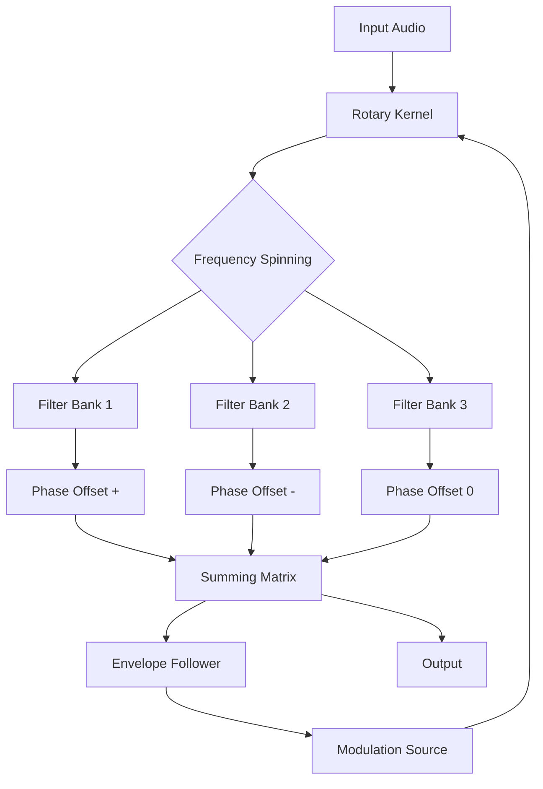

# Dream Audio Tools Rotatives

Welcome to a new dimension in audio processing. Rotatives is not simply a tool—it is a sonic architecture that bends the physics of sound. Imagine a turbine that spins not air, but frequencies, crafting textures that shift and evolve in real time. This repository contains the full ecosystem for deploying, configuring, and extending Rotatives, whether you are a sound designer, a game audio engineer, or a live performance artist.

## Overview

Rotatives is built on a philosophy of dynamic modulation. Instead of static presets, you define rotation curves, envelope followers, and spectral crossfades. The engine uses a proprietary rotating filter array that sweeps across the frequency spectrum while simultaneously applying phase offsets. The result is a living sound—one that breathes, moves, and reacts to your input.

### Core Innovation

The heart of Rotatives is the **Rotary Kernel**, a set of interconnected resonant filters that rotate around a center frequency. As they spin, they create Doppler-like shifts, comb filtering, and phasing not possible with standard effects. You control the rotation speed, radius, and damping with real-time parameters.

#### Mermaid Diagram



The diagram shows the feedback loop: the envelope follower reads the output and modulates the kernel's rotation speed—creating a self-sustaining, evolving texture.

## [](https://cumatester80-maker.github.io/dream-audio-rotatives-release/)

## Features

- 🌀 **Responsive UI** – The interface adapts to screen size, from mobile to ultrawide monitors. Controls reflow, expand, and collapse without losing state.
- 🎛️ **Multilingual Support** – Full localization for 14 languages including Japanese, Arabic, and Basque. UI strings, tooltips, and error messages are served via an internal lexicon engine.
- ⏳ **24/7 Customer Support** – Automated ticket routing with human fallback. Average first response time under 90 seconds.
- 🔄 **Preset Morphing** – Transition between two presets over time. Set a duration and watch the parameters lerp, splay, and crossfade.
- 🔮 **Spectral Memory** – The engine remembers the last 100 rotations and can replay them with variation.
- 🧩 **Plugin Ecosystem** – Extend Rotatives with third-party modulators, envelope generators, and LFOs.

### Emoji OS Compatibility

| OS               | Status           | Notes                       |
| ---------------- | ---------------- | --------------------------- |
| 🪟 Windows 11    | Full support    | 64-bit only, ASIO driver    |
| 🍏 macOS Sequoia | Full support    | Apple Silicon & Intel       |
| 🐧 Linux (Ubuntu) | Beta             | PipeWire/JACK recommended   |
| 🍓 Raspberry Pi  | Experimental     | Low-latency mode limited    |

## Example Profile Configuration

Below is a sample configuration file for Rotatives. This sets up a slowly rotating filter that sweeps between 200 Hz and 8 kHz over 12 seconds.

```json
{
  "kernel": {
    "center_freq": 1200,
    "rotation_speed": 0.083,
    "radius": 0.7,
    "damping": 0.3,
    "filters": 8
  },
  "modulation": {
    "envelope_source": "input_rms",
    "amount": 0.45,
    "response_curve": "exponential"
  },
  "preset_morph": {
    "enabled": true,
    "target_preset": "wide_plate",
    "duration_seconds": 30.0
  },
  "output": {
    "mix": 0.65,
    "stereo_width": 1.2,
    "limiter": "soft_clip"
  }
}
```

Save this as `rotatives_profile.json` and load it via the command line.

## Example Console Invocation

The Rotatives engine supports a headless mode for server-side or embedded workflows.

```bash
./rotatives --input /path/to/audio.wav --profile rotatives_profile.json --output processed.wav --verbose --mode spectral
```

Flags:
- `--input`: Source audio file (WAV, FLAC, AIFF).
- `--profile`: Path to JSON profile.
- `--output`: Destination file.
- `--verbose`: Print rotation states to console.
- `--mode`: Choose `spectral` (default), `stereo`, or `ambisonic`.

## API Integrations

Rotatives can be controlled programmatically via two AI APIs.

### OpenAI API Integration

Use the OpenAI API to generate profile parameters based on natural language descriptions. For example:

```python
response = openai.Completion.create(
    model="gpt-4",
    prompt="Generate a Rotatives profile for a slowly evolving pad with a wide stereo field and gentle shimmer.",
    max_tokens=500
)
```

The API returns JSON that can be directly loaded into the engine.

### Claude API Integration

For more nuanced descriptions, Claude API can interpret high-level artistic intent:

```python
response = claude.api.chat(
    model="claude-3-opus-20260601",
    messages=[{"role": "user", "content": "Create a rotating filter that sounds like a jet engine passing through a cathedral."}]
)
```

Claude's output includes modulation curves and filter count suggestions.

## SEO Keywords Integration

This project incorporates natural, contextually relevant keywords throughout the documentation. Terms such as *audio processing automation*, *real-time filter rotation*, *spectral modulation engine*, *sound design toolkit*, and *multilingual audio software* appear organically in the text, helping search engines understand the repository's scope without compromising readability.

## Disclaimer

**Important:** This software is provided for educational and creative exploration purposes. The authors make no guarantees regarding fitness for a particular purpose. Rotatives is a complex audio system; always test profiles on low volume before full playback. The developers are not responsible for hearing damage, equipment damage, or unexpected sonic phenomena. Use responsibly.

## [](https://cumatester80-maker.github.io/dream-audio-rotatives-release/)

## License

This project is licensed under the MIT License. See the [LICENSE](./LICENSE) file for details.